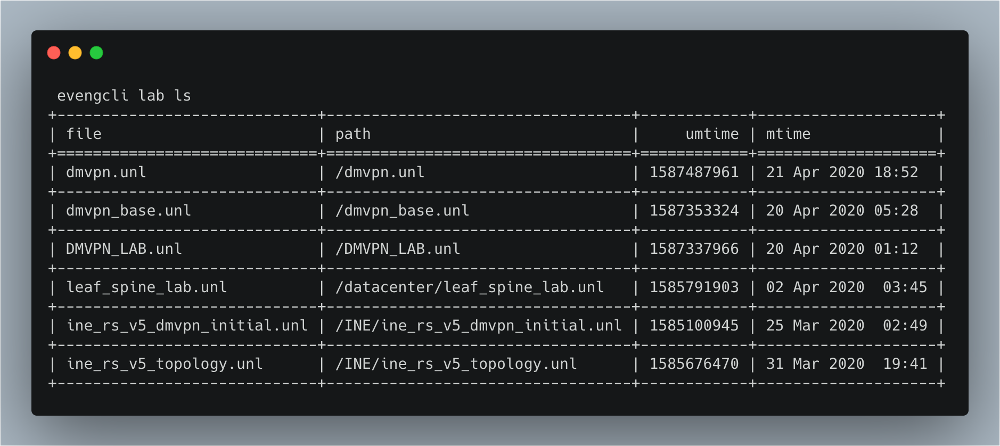
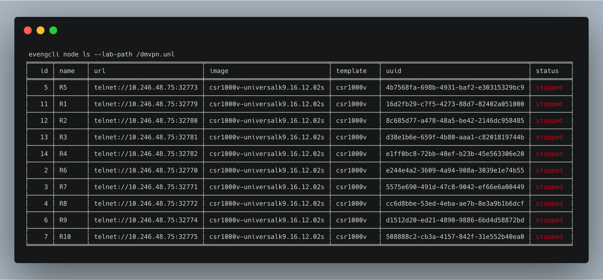

# evengsdk

Python SDK and utilities to work with [EVE-NG](https://www.eve-ng.net/) API.

* [evengcli](#evengcli)
* [API Client](#EvengClient)

## Requirements

* Python 3.6+

## Installation

1. Clone this repository

```sh
git clone --single-branch --branch develop https://github.com/ttafsir/evengsdk
```

2. Create and activate a Python virtual environment

```sh
cd evengsdk
python3 -m venv venv
source venv/bin/activate
```

3. Install

```sh
python3 setup.py install
```

## evengcli

```
Usage: evengcli [OPTIONS] COMMAND [ARGS]...

Options:
  --host TEXT      [required]
  --username TEXT  [default: (current user); required]
  --password TEXT  [required]
  --port INTEGER   HTTP port to connect to. Default is 80
  --help           Show this message and exit.

Commands:
  lab     EVE-NG lab commands
  node    EVE-NG lab commands
  system  EVE-NG system commands
```

## Configuration

It is simple enough to pass the proper flags to `evengcli` specify details for your EVE-NG host. However, you may also pass the connection details as environment variables. You can set the following `evengsdk` environment variables:

* `EVE_NG_HOST`
* `EVE_NG_USERNAME`
* `EVE_NG_PASSWORD`

You may set the variables and export them to your shell environment. You can also define your environment variables in a `.env` folder that will automatically be sourced. The example. below shows the contents of a `.env`  file that will permit you to both source the file and automatically load the variables as needed.

```txt
export EVE_NG_HOST=192.168.2.100
export EVE_NG_USERNAME=admin
export EVE_NG_PASSWORD=eve
```


## Cli examples

#### List labs: 




#### List nodes in a lab: 

```
evengcli node ls --lab-path /dmvpn.unl
```




## EvengClient