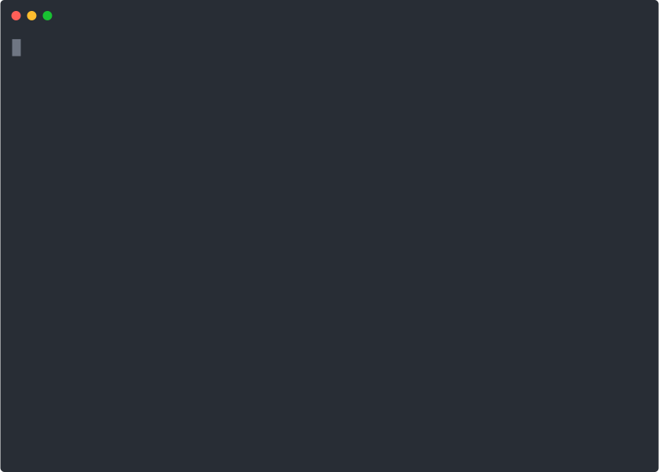

# evengsdk

Python SDK and command line utilities to work with the [EVE-NG](https://www.eve-ng.net/)  [REST API](https://www.eve-ng.net/index.php/documentation/howtos/how-to-eve-ng-api/) .

* [Rest API Client ](#developing-with-the-evengclient) -  Python client  library for managing Eve-NG Server
* [EVE-NG CLI application](#using-eve-ng-cli-application) - `Click` based CLI application to interact with the EVE-NG [REST API](https://www.eve-ng.net/index.php/documentation/howtos/how-to-eve-ng-api/) via the command-line

## Requirements

* Python 3.8+
* An EVE-NG instance

## :rocket:Getting Started

1. Clone this repository

```sh
git clone https://github.com/ttafsir/evengsdk
```

2. Create a Python virtual environment and install dependencies

```sh
cd evengsdk
rm -rf .venv
python -m venv .venv
pip install -r requirements.txt
```

3. Install the CLI application (optional)

```sh
python3 setup.py install
```

## Developing with the `EvengClient`

### The `EvengClient` REST client

```python
>>> from evengsdk.client import EvengClient
>>> client = EvengClient('10.246.32.119')
>>>
>>> client.login(username='admin', password='eve')
>>> client.get('/status')
{'version': '2.0.3-112', 'qemu_version': '2.4.0', 'uksm': 'enabled', 'ksm': 'unsupported', 'cpulimit': 'enabled', 'cpu': 0, 'disk'
: 16, 'cached': 96, 'mem': 6, 'swap': 0, 'iol': 0, 'dynamips': 0, 'qemu': 1, 'docker': 0, 'vpcs': 0}
>>>
```
### Using the client's API wrapper

```python
>>> # using the API wrapper on the client
>>> client.api.get_server_status()
{'version': '2.0.3-112', 'qemu_version': '2.4.0', 'uksm': 'enabled', 'ksm': 'unsupported', 'cpulimit': 'enabled', 'cpu': 1, 'di
sk': 16, 'cached': 96, 'mem': 6, 'swap': 0, 'iol': 0, 'dynamips': 0, 'qemu': 1, 'docker': 0, 'vpcs': 0}
>>>
>>> # create lab using the API wrapper object
>>> lab = {
...     'name': 'TestLab',
...     'path': '/',
...     'description': 'short description',
...     'version': '1',
...     'body': 'longer description'
... }
>>> client.api.create_lab(**lab)
{'code': 200, 'status': 'success', 'message': 'Lab has been created (60019).'}
```


## Using `eve-ng` CLI application

The CLI application provides an interface to manage EVE-NG objects including:

* `Folders` - manage the directory-like structures that contains labs
* `Labs` - manage labs and objects inside labs (nodes, networks, links, etc)
  * nodes
  * networks
  * links
  * pictures
  * Links
* `Users` - manage system users
* `System` - View system status and resources (node templates, network types, user roles, etc..)

<p align="center">
  
</p>


## :gear: Configuration

It is simple enough to pass the proper flags to `eve-ng` specify details for your EVE-NG host. However, you may also pass the connection details as environment variables. You can set the following `evengsdk` environment variables:

* `EVE_NG_HOST`
* `EVE_NG_USERNAME`
* `EVE_NG_PASSWORD`

You may set the variables and export them to your shell environment. You can also define your environment variables in a `.env` folder that will automatically be sourced. The example. below shows the contents of a `.env`  file that will permit you to both source the file and automatically load the variables as needed.

```txt
export EVE_NG_HOST=192.168.2.100
export EVE_NG_USERNAME=admin
export EVE_NG_PASSWORD=eve
export EVE_NG_LAB_PATH='/datacenter/leaf_spine_lab.unl'
```
