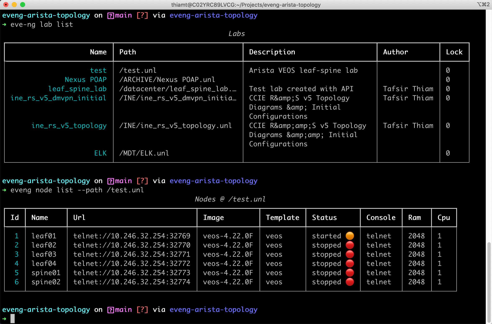

# evengsdk

Open source library and command line utilities to work with the [EVE-NG](https://www.eve-ng.net/)  [REST API](https://www.eve-ng.net/index.php/documentation/howtos/how-to-eve-ng-api/) .

Evegnsdk allows you to quickly build network topologies in EVE-NG for testing and development. The CLI tool also enables you quickly integrate EVE-NG into your CI/CD toolset for automated testing and validation.

* [Requirements](#requirements)
* [Installation](#rocketinstallation)
* [Basic Usage](#basic-usage)
  * [Example: Build a Lab](#example-build-a-lab)
* [API Wrapper Methods](#api-wrapper-methods)
* Using the `eve-ng` CLI
  * [The `eve-ng` CLI application](#the-eve-ng-cli-application)
  * [Configuration](#gear-configuration)
  * [IaC/CICD](#iac--cicd)

## Requirements

* Python 3.8+
* An EVE-NG instance

## :rocket:Installation

You can install `evengsdk` using pip

```sh
pip install eve-ng
```

## Basic Usage

You can interact with the EVE-NG API through the `client.api` interface

```python
>>> from evengsdk.client import EvengClient
>>> from pprint import pprint
>>>
>>> client = EvengClient("10.246.32.254", log_file="test.log")
>>> client.login(username="admin", password="eve")
>>>
>>> resp = client.api.list_node_templates()
>>> pprint(resp.get("data"))
{'a10': 'A10 vThunder.missing',
 'acs': 'Cisco ACS.missing',
 'aruba': 'Aruba WiFi Controller.missing',
 'arubacx': 'Aruba OS-CX Virtual Switch.missing',
 'asa': 'Cisco ASA.missing',
 'asav': 'Cisco ASAv',
 'bigip': 'F5 BIG-IP LTM VE',
 'cumulus': 'Cumulus VX',
 'infoblox': 'Infoblox IPAM',
 'iol': 'Cisco IOL.missing',
 'ise': 'Cisco ISE.missing',

 <OUTPUT OMMITTED FOR BREVITY>

 'linux': 'Linux',
 'mikrotik': 'MikroTik RouterOS.missing',
 'nsx': 'VMWare NSX.missing',
 'nxosv9k': 'Cisco NX-OSv 9K',
 'olive': 'Juniper Olive.missing',
 'ostinato': 'Ostinato',
 'osx': 'Apple OSX.missing',
 'paloalto': 'Palo Alto.missing',
 'pfsense': 'pfSense Firewall.missing',
 'vcenter': 'VMWare vCenter.missing',
 'vios': 'Cisco vIOS Router',
 'viosl2': 'Cisco vIOS Switch',
 'vmx': 'Juniper vMX.missing',
 'vwlc': 'Cisco vWLC.missing',
 'vyos': 'VyOS',
 'win': 'Windows.missing',
 'winserver': 'Windows Server.missing',
 'xrv': 'Cisco XRv.missing',
 'xrv9k': 'Cisco XRv 9000.missing'}
>>>
```
#### Example: Build a Lab

```python
from evengsdk.client import EvengClient


client = EvengClient("10.246.32.254", log_file="test.log")
client.login(username="admin", password="eve")
client.set_log_level("DEBUG")

# create a lab
lab = {"name": "test_lab", "description": "Test Lab", "path": "/"}
resp = client.api.create_lab(**lab)
if resp['status'] == "success":
  print("lab created successfully.")

# we need the lab path to create objects in the lab
lab_path = f"{lab['path']}{lab['name']}.unl"

# create management network
mgmt_cloud = {"name": "eve-mgmt", "network_type": "pnet1"}
client.api.add_lab_network(lab_path, **mgmt_cloud)

# create Nodes
nodes = [
    {"name": "leaf01", "template": "veos", "image": "veos-4.22.0F", "left": 50},
    {"name": "leaf02", "template": "veos", "image": "veos-4.22.0F", "left": 200},
]
for node in nodes:
    client.api.add_node(lab_path, **node)

# connect nodes to management network
mgmt_connections = [
    {"src": "leaf01", "src_label": "Mgmt1", "dst": "eve-mgmt"},
    {"src": "leaf02", "src_label": "Mgmt1", "dst": "eve-mgmt"}
]
for link in mgmt_connections:
    client.api.connect_node_to_cloud(lab_path, **link)

# create p2p links
p2p_links = [
    {"src": "leaf01", "src_label": "Eth1", "dst": "leaf02", "dst_label": "Eth1"},
    {"src": "leaf01", "src_label": "Eth1", "dst": "leaf02", "dst_label": "Eth2"},
]
for link in p2p_links:
    client.api.connect_node_to_node(lab_path, **link)

client.logout()
```

## API Wrapper Methods

<details>
<summary>System</summary>

*  `get_server_status`
* `node_template_detail`
* `list_node_templates`
* `list_user_roles`
* `list_networks`

</details>

<details>
<summary>Users</summary>

* `list_users`
* `add_user`
* `get_user`
* `edit_user`
* `delete_user`

</details>

<details>
<summary>Labs</summary>

* `get_lab`
* `create_lab`
* `delete_lab `
* `edit_lab`
* `lock_lab`
* `unlock_lab`
* `export_lab`
* `import_lab`

</details>

<details>
<summary>Nodes</summary>

* `list_nodes`
* `add_node`
* `get_node`
* `get_node_by_name`
* `delete_node`
* `node_exists`
* `get_node_config_by_id`
* `get_node_configs`
* `get_node_interfaces`
* `export_node`
* `export_all_nodes`
* `start_all_nodes`
* `start_node`
* `stop_all_nodes`
* `stop_node`
* `upload_node_config`
* `wipe_all_nodes`
* `wipe_node`
* `connect_node_to_cloud`
* `connect_node_to_node`

</details>

<details>
<summary>Lab Networks</summary>

* `add_lab_network`
* `edit_lab_network`
* `delete_lab_network`
* `get_lab_network`
* `get_lab_network_by_name`
* `get_lab_topology`
* `list_lab_networks`

</details>

<details>
<summary>Folders</summary>

* `get_folder`
* `list_folders`

</details>


## Using `eve-ng` CLI application

The CLI application provides an interface to manage EVE-NG objects including:

* `Folders` - manage the directory-like structures that contains labs
* `Labs` - manage labs and objects inside labs (nodes, networks, links, etc)
  * nodes
  * networks
* `Users` - manage system users
* `System` - View system status and resources (node templates, network types, user roles, etc..)


## The `eve-ng` CLI Application

The CLI application makes it very simple to quick work with EVE-NG, especially in situation where you would like to automate lab builds and testing using CI/CD.

```zsh
➜ eveng --help
Usage: eveng [OPTIONS] COMMAND [ARGS]...

  CLI application to manage EVE-NG objects

Options:
  --host TEXT           [required]
  --username TEXT       [default: (current user); required]
  --password TEXT       [required]
  --port INTEGER        HTTP port to connect to. Default is 80
  --debug / --no-debug  Enables or disables debug mode.
  -v, --verbose         Enables verbosity.
  --help                Show this message and exit.

Commands:
  folder               folder sub commands
  lab                  lab sub commands
  list-network-types   list EVE-NG network types
  list-node-templates  list EVE-NG node templates
  list-user-roles      list EVE-NG user roles
  node                 node sub commands
  show-status          View EVE-NG server status
  show-template        get EVE-NG node template details
  user                 user sub commands
  version              display library version
```

### CLI sample output



## :gear: Configuration

It is simple enough to pass the proper flags to `eve-ng` specify details for your EVE-NG host. However, you may also pass the connection details as environment variables. You can set the following `evengsdk` environment variables:

* `EVE_NG_HOST ` - EVE-NG host name or IP address
* `EVE_NG_USERNAME` - EVE-NG username
* `EVE_NG_PASSWORD ` EVE-NG API/GUI password
* `EVE_NG_LAB_PATH` - EVE-NG default lab path. Ex. `/myLab.unl`

You may set the variables and export them to your shell environment. You can also define your environment variables in a `.env` folder that will automatically be sourced. The example. below shows the contents of a `.env`  file that will permit you to both source the file and automatically load the variables as needed.

```txt
export EVE_NG_HOST=192.168.2.100
export EVE_NG_USERNAME=admin
export EVE_NG_PASSWORD=eve
export EVE_NG_LAB_PATH='/datacenter/leaf_spine_lab.unl'
```


## IaC / CICD

The CLI application allows you to build lab topologies using a declarative model in order to quickly spin a lab and configure nodes using configuration files or jinja templates. Below is a sample topology that is the `examples` directory of this project.

```yaml
---
  name: test
  description: Arista VEOS leaf-spine lab
  path: "/"
  nodes:
    - name: leaf01
      template: veos
      image: veos-4.22.0F
      node_type: qemu
      left: 50
      top: 135
      configuration:
        file: examples/configs/test_leaf01.cfg
    - name: leaf02
      template: veos
      image: veos-4.22.0F
      node_type: qemu
      left: 200
      top: 135
      configuration:
        template: base.j2
        vars:
          hostname: leaf02
          management_address: 10.10.10.1
    - name: leaf03
      template: veos
      image: veos-4.22.0F
      node_type: qemu
      left: 350
      top: 135
      configuration:
        template: base.j2
        vars: examples/data/leaf03.yml
    - name: leaf04
      template: veos
      image: veos-4.22.0F
      node_type: qemu
      left: 500
      top: 135
    - name: spine01
      template: veos
      image: veos-4.22.0F
      node_type: qemu
      left: 150
      top: 474
    - name: spine02
      template: veos
      image: veos-4.22.0F
      node_type: qemu
      left: 350
      top: 474
  networks:
    - name: vCloud
      network_type: pnet1
      visibility: 1
      top: 300
      left: 475
  links:
    network:
      - {"src": "leaf01", "src_label": "Mgmt1", "dst": "vCloud"}
      - {"src": "leaf02", "src_label": "Mgmt1", "dst": "vCloud"}
      - {"src": "leaf03", "src_label": "Mgmt1", "dst": "vCloud"}
      - {"src": "leaf04", "src_label": "Mgmt1", "dst": "vCloud"}
      - {"src": "spine01", "src_label": "Mgmt1", "dst": "vCloud"}
      - {"src": "spine02", "src_label": "Mgmt1", "dst": "vCloud"}
    node:
      - {"src": "leaf01", "src_label": "Eth3", "dst": "spine01", "dst_label": "Eth1"}
      - {"src": "leaf02", "src_label": "Eth3", "dst": "spine01", "dst_label": "Eth2"}
      - {"src": "leaf03", "src_label": "Eth3", "dst": "spine01", "dst_label": "Eth3"}
      - {"src": "leaf04", "src_label": "Eth3", "dst": "spine01", "dst_label": "Eth4"}
      - {"src": "leaf01", "src_label": "Eth2", "dst": "spine02", "dst_label": "Eth1"}
      - {"src": "leaf02", "src_label": "Eth2", "dst": "spine02", "dst_label": "Eth2"}
      - {"src": "leaf03", "src_label": "Eth2", "dst": "spine02", "dst_label": "Eth3"}
      - {"src": "leaf04", "src_label": "Eth2", "dst": "spine02", "dst_label": "Eth4"}

```

To create a topology from the example above simply run the following command

```sh
eve-ng lab create-from-topology -t examples/test_topology.yml --template-dir examples/templates
```

By default, the configuration tool searches for templates in `templates` directory, but you can use `--template-dir` as shown above to specify another location.
